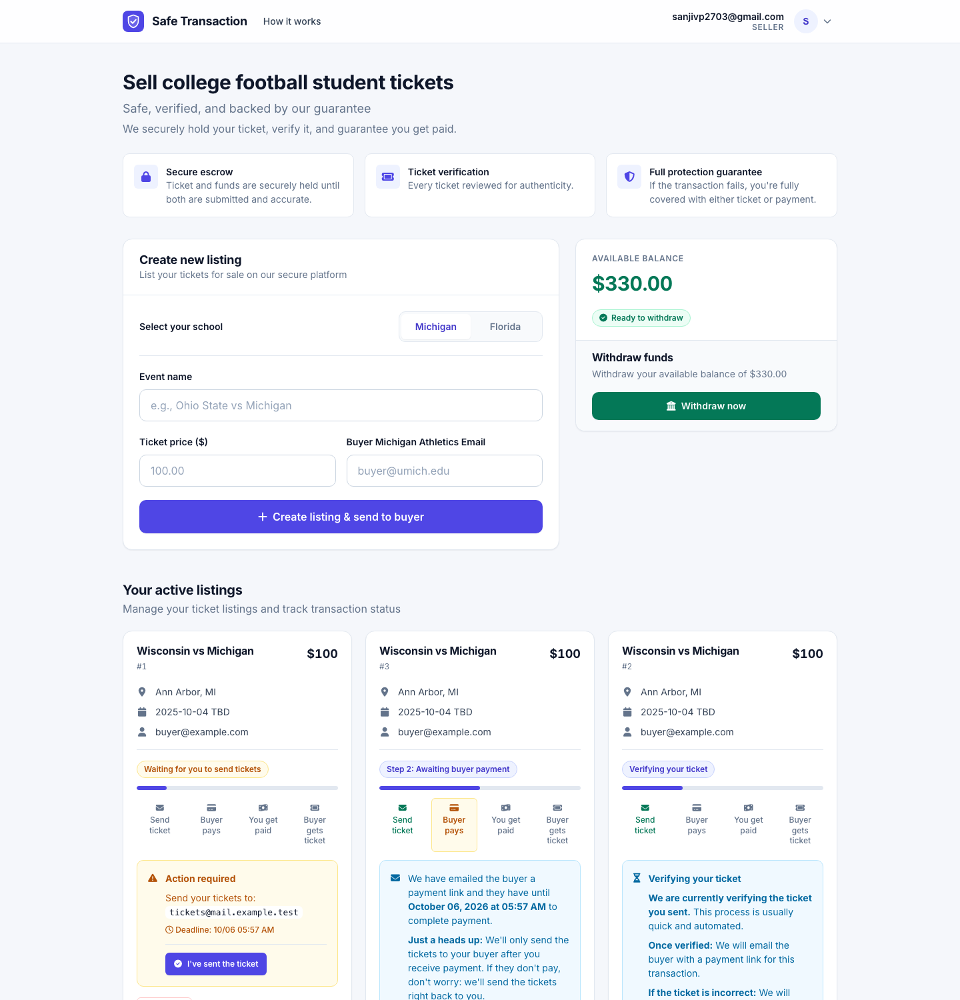
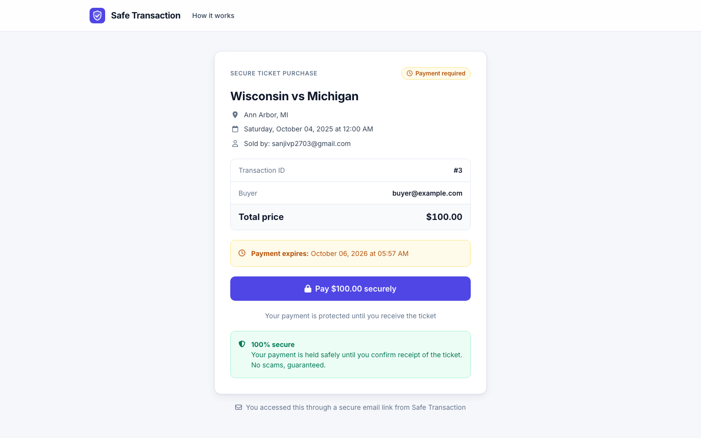
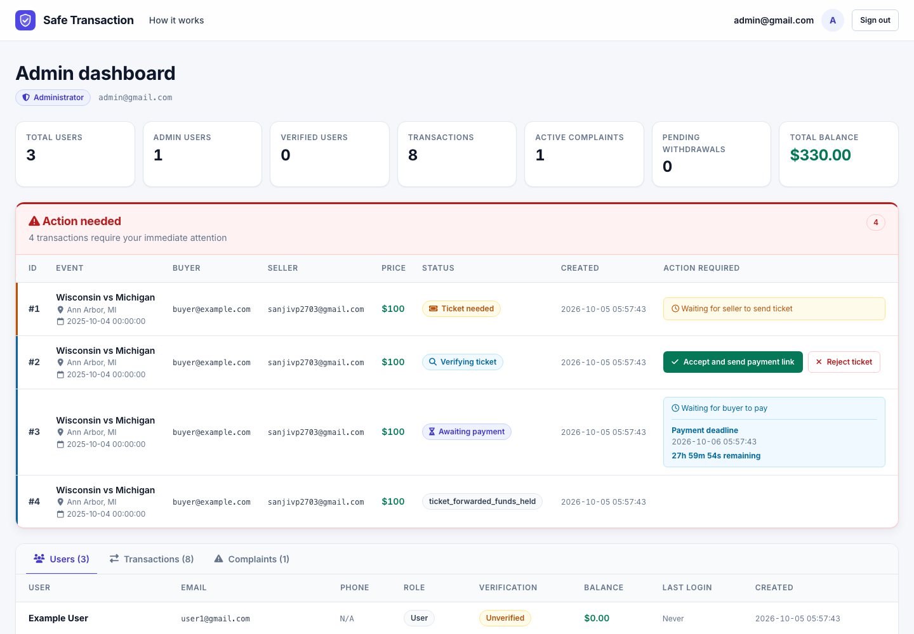
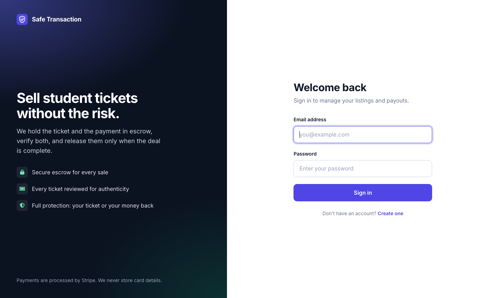
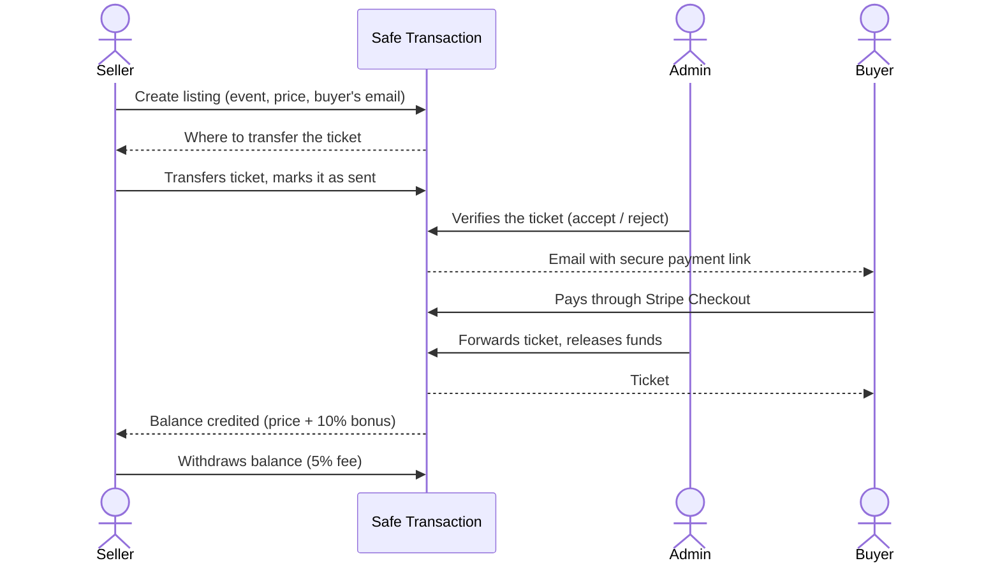

# Safe Transaction

Escrow for peer-to-peer student ticket sales. A seller lists a ticket for a
specific buyer, Safe Transaction takes custody of the ticket, verifies it,
collects the buyer's payment through Stripe, and only then releases the ticket
to the buyer and the money to the seller. Either both sides of the deal happen
or neither does.

Production: <https://safetransaction.app>

| Seller dashboard | Buyer offer page |
| --- | --- |
|  |  |
| **Admin console** | **Sign in** |
|  |  |

## Contents

- [How it works](#how-it-works)
- [Features](#features)
- [Tech stack](#tech-stack)
- [Getting started](#getting-started)
- [Configuration](#configuration)
- [Project layout](#project-layout)
- [Database](#database)
- [Testing and linting](#testing-and-linting)
- [Front end](#front-end)
- [Deployment](#deployment)
- [Further documentation](#further-documentation)

## How it works



Each sale is one row in `transactions` and moves through a small state
machine:

| Stage | Status | What is happening |
| --- | --- | --- |
| Listed | `pending_ticket_submission` | Listing created; waiting for the seller to transfer the ticket |
| Verification | `waiting_for_verification` | Seller says the ticket was sent; an admin checks it |
| Payment | `waiting_for_payment` | Ticket accepted; the buyer has been emailed a payment link |
| Escrow | `ticket_forwarded_funds_held` | Buyer paid; ticket forwarded, funds held for the seller |
| Done | `completed` | Funds released to the seller's balance |
| Exceptions | `cancelled`, `payment_deadline_expired`, `expired_no_ticket`, `complaint_filed`, ... | Cancelled, timed out, or under dispute |

The complete list of statuses and transitions is in
[docs/operations/transaction-status-reference.md](docs/operations/transaction-status-reference.md).

The platform currently runs in **manual-operations mode**: an admin performs
verification and fund release from the admin dashboard. The automated pipeline
(inbound-email ticket detection, deadline enforcement, background jobs) is
still in the codebase but switched off; see
[`insta485/__init__.py`](insta485/__init__.py).

## Features

**Sellers**

- Create a listing for a named buyer, with event autocomplete per school
  (Michigan and Florida) and per-event price caps
- Track every listing through its stages on the dashboard
- Balance, earnings history, and withdrawals by Stripe Connect or manual payout

**Buyers**

- No account needed: a secure offer page reached from an emailed link
- Card payment through Stripe Checkout
- Report a problem with a ticket, which opens a complaint for admin review

**Admins**

- Action queue for tickets awaiting verification and funds awaiting release
- Accept or reject tickets, refund buyers, pay sellers, resolve complaints
- Process manual withdrawal requests; manage users and admin roles

**Platform**

- Transactional email through Mailgun (plus Gmail SMTP for buyer confirmations)
- PDF receipts
- Structured, rotating log files for application, payment, and email events

## Tech stack

| Layer | Technology |
| --- | --- |
| Web framework | Flask 2.3 (server-rendered Jinja templates) |
| Database | SQLite |
| Payments | Stripe Checkout and Stripe Connect |
| Email | Mailgun HTTP API, Flask-Mail (SMTP) |
| Background jobs | APScheduler, `schedule` |
| Front end | Hand-written CSS design system, vanilla JavaScript, Font Awesome, Inter |
| Tooling | pytest, Ruff, GitHub Actions |
| Production | Gunicorn behind Nginx |

## Getting started

Requirements: Python 3.10 or newer and the `sqlite3` command-line tool.

```bash
git clone https://github.com/sanjivp2703/Safe-Transaction.git
cd Safe-Transaction

./bin/insta485install        # virtualenv, dependencies, and a starter .env
source .venv/bin/activate

./bin/insta485db create      # build var/insta485.sqlite3 from sql/
./bin/insta485run            # http://localhost:8000
```

`insta485install` copies `.env.example` to `.env` and generates a
`SECRET_KEY`. Add your Stripe test key and Mailgun credentials to `.env` to
exercise payments and email; the rest of the app runs without them.

The seed data contains a regular user and an admin. For local work, set
`ENABLE_DEV_LOGIN=1` in `.env` to get "Sign in as seller / admin" shortcuts on
the sign-in page. To promote any existing account to admin:

```bash
python bin/make_admin.py someone@example.com
```

<details>
<summary>Manual setup without the helper scripts</summary>

```bash
python3 -m venv .venv && source .venv/bin/activate
pip install -r requirements-dev.txt && pip install -e .
cp .env.example .env         # then set SECRET_KEY and the service keys
mkdir -p var/uploads
sqlite3 var/insta485.sqlite3 < sql/schema.sql
sqlite3 var/insta485.sqlite3 < sql/data.sql
flask --app insta485 --debug run --port 8000
```

</details>

## Configuration

All configuration is read from environment variables
([`insta485/config.py`](insta485/config.py)). In development they are loaded
from `.env`; in production set them in the service environment. No credential
lives in source control.

| Variable | Required | Purpose |
| --- | --- | --- |
| `SECRET_KEY` | Yes | Signs session cookies. The app refuses to start without it. |
| `STRIPE_SECRET_KEY` | For payments | Stripe secret key (`sk_test_...` or `sk_live_...`) |
| `MAILGUN_DOMAIN` | For email | Mailgun sending domain |
| `MAILGUN_API_KEY` | For email | Mailgun private API key |
| `MAILGUN_BASE_URL` | No | Defaults to `https://api.mailgun.net/v3/<MAILGUN_DOMAIN>` |
| `MAIL_SERVER`, `MAIL_PORT`, `MAIL_USE_TLS`, `MAIL_USERNAME`, `MAIL_PASSWORD`, `MAIL_DEFAULT_SENDER` | No | SMTP relay for Flask-Mail; defaults target Mailgun |
| `GMAIL_APP_PASSWORD` | No | App password for the Gmail account that sends buyer confirmations |
| `ENABLE_DEV_LOGIN` | No | `1` enables password-less sign-in shortcuts. **Never set in production.** |
| `INSTA485_SETTINGS` | No | Path to a Python file whose values override the config |

## Project layout

```text
.
├── insta485/                 Application package (name kept from the project's origins)
│   ├── __init__.py           App factory wiring: config, mail, scheduler, route registration
│   ├── config.py             Environment-driven settings
│   ├── model.py              SQLite connection handling
│   ├── views/                Page routes
│   │   ├── index.py          Seller dashboard, listings, buyer payment flow, receipts
│   │   ├── manage.py         Accounts, verification codes, Stripe onboarding
│   │   ├── balance.py        Balance, earnings, withdrawals
│   │   ├── admin.py          Admin dashboard, users, complaints
│   │   ├── admin_actions.py  Ticket verification, fund release, refunds
│   │   └── ticket.py         Ticket validation and problem reports
│   ├── api/transactions.py   JSON endpoints and webhooks for the transaction lifecycle
│   ├── transaction_manager.py, deadline_manager.py, background_jobs.py, email_monitor.py
│   │                         Automated workflow (currently disabled)
│   ├── email_automation.py, mailgun_sender.py, email_utils.py, gmail_sender.py
│   │                         Transactional email
│   ├── templates/            Jinja templates (layouts/, partials/, one file per page)
│   └── static/               css/app.css design system, css/pages/, js/pages/, img/
├── sql/                      schema.sql and seed data.sql
├── migrations/               Incremental SQL migrations for existing databases
├── bin/                      Developer and operations scripts
├── tests/                    pytest suite
├── docs/                     Operations, deployment, and archived design notes
└── var/                      Runtime data: database and uploads (not in version control)
```

## Database

SQLite, stored at `var/insta485.sqlite3`.

| Table | Contents |
| --- | --- |
| `users` | Accounts, admin flag, Stripe Connect id, balance |
| `events` | Games that can be listed, per school, with a maximum ticket price |
| `transactions` | One row per sale, with status, deadlines, and ticket/payment tracking |
| `monetary_transactions` | Ledger of purchases, refunds, and withdrawals |
| `balance_changes` | Per-user earnings and withdrawals |
| `withdrawal_requests` | Payout requests and their processing state |
| `verification_codes` | Email and phone verification codes |

Units matter: `transactions.price` is in **dollars**; `users.balance`,
`balance_changes.amount`, `events.max_ticket_price`, and every
`withdrawal_requests` amount are in **cents**.

```bash
./bin/insta485db create     # create and seed
./bin/insta485db reset      # drop and recreate (destroys local data)
./bin/insta485db dump       # print the main tables
```

`sql/schema.sql` always describes the current schema. Files in `migrations/`
bring an older database up to date and are applied by hand, in order:

```bash
sqlite3 var/insta485.sqlite3 < migrations/0013_add_withdrawal_requests.sql
```

## Testing and linting

```bash
./bin/insta485test          # ruff + pytest
pytest -q                   # tests only
ruff check insta485 bin tests
ruff format insta485 bin tests
```

Tests run against a temporary database built from `sql/` and never touch
`var/`. They cover access control, sign-in, the public JSON API, rendering of
every primary page for each transaction status, and a guard that fails if a
credential is committed to source. The same checks run in GitHub Actions on
every push and pull request.

## Front end

Pages are server-rendered. Every template extends
[`templates/layouts/base.html`](insta485/templates/layouts/base.html) and is
styled by one design system,
[`static/css/app.css`](insta485/static/css/app.css): design tokens (colour,
type, spacing, radius, elevation) plus shared components (buttons, forms,
cards, alerts, badges, tables, detail lists, status pages). Page-specific
rules live in `static/css/pages/` and are written with the same tokens. There
is no build step.

## Deployment

Production runs Gunicorn (`insta485:app`) behind Nginx on a single VM. Full
instructions are in [docs/deployment](docs/deployment):

- [production-setup.md](docs/deployment/production-setup.md): server, Nginx, Gunicorn, TLS
- [updating-production.md](docs/deployment/updating-production.md): rolling out a new version
- [dns-email-authentication.md](docs/deployment/dns-email-authentication.md): SPF, DKIM, DMARC for Mailgun
- [deployment-checklist.md](docs/deployment/deployment-checklist.md)

Upgrading a server deployed from an earlier revision needs one-time steps
(back up `var/`, set the environment variables, rotate old keys): follow
[upgrade-notes.md](docs/deployment/upgrade-notes.md) before pulling.

Checklist for every production environment:

1. Set `SECRET_KEY`, `STRIPE_SECRET_KEY`, `MAILGUN_DOMAIN`, and
   `MAILGUN_API_KEY` in the service environment (or in `.env` beside the code).
2. Leave `ENABLE_DEV_LOGIN` unset.
3. Keep `var/` (database and uploads) outside of version control and back it
   up; it is no longer tracked by git.
4. `pip install -r requirements.txt`, then restart the service.

## Further documentation

| Topic | Document |
| --- | --- |
| Transaction statuses and flows | [docs/operations/transaction-status-reference.md](docs/operations/transaction-status-reference.md) |
| Processing withdrawals | [docs/operations/admin-withdrawal-guide.md](docs/operations/admin-withdrawal-guide.md) |
| Withdrawal system design | [docs/operations/withdrawal-system.md](docs/operations/withdrawal-system.md) |
| Handling complaints | [docs/operations/complaint-handling.md](docs/operations/complaint-handling.md) |
| Refund policy | [docs/operations/refund-policy.md](docs/operations/refund-policy.md) |
| Historical design notes | [docs/archive](docs/archive) |
